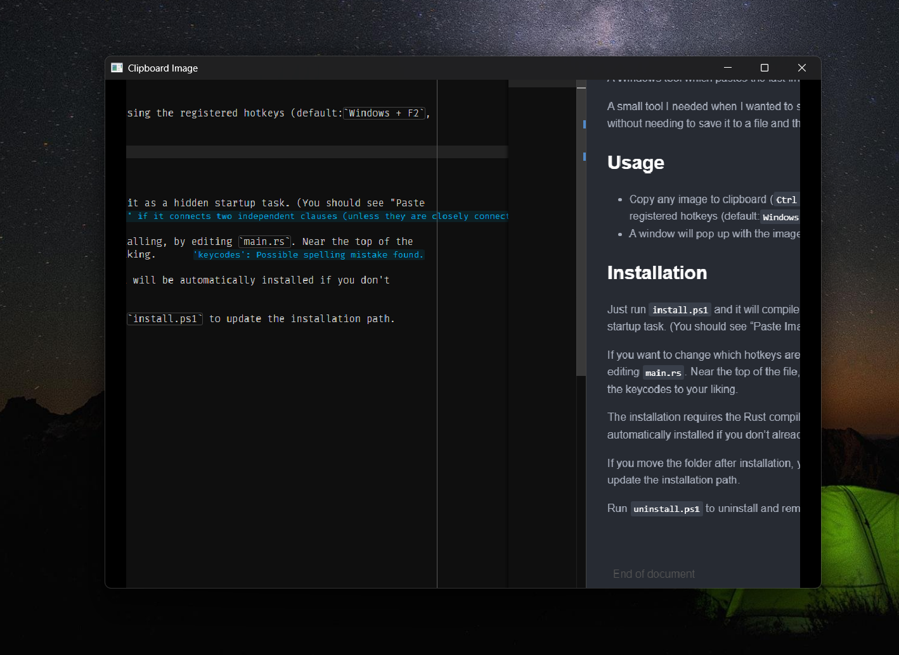

# Paste Image To Window

A Windows tool which pastes the last image from clipboard to a window.

A small tool I needed when I wanted to see what image is in my clipboard without needing to save it to a file and then open it.

## Usage

* Copy any image to clipboard (`Ctrl + c`) and run the tool by pressing the registered hotkeys (default:`Windows + F2`, or `F16`, if you have it).

* A window will pop up with the image in it.



## Installation

* Just run `install.ps1`. It will compile the program and install it as a hidden startup task. (You should see "Paste Image To Window" in the Task Scheduler). It will also immediately start the program.

* If you want to change which hotkeys are used, you do so before installing, by editing `main.rs`. Near the top of the file, find:

  ```rust
  const KEY1: i32 = VK_F16;
  const KEY1_MODIFIERS: isize = 0;
  const KEY2: i32 = VK_F2;
  const KEY2_MODIFIERS: isize = MOD_WIN;
  ```
  ...and change as required. You may combine modifiers with `|`, e.g., `MOD_WIN | MOD_SHIFT` would be Windows key + Shift.

* The installation requires the Rust compiler to be installed, but it will be automatically installed if you don't already have it.

* If you move the folder after installation, you will need to re-run `install.ps1` to update the installation path.

* Run `uninstall.ps1` to uninstall and remove the startup task. It will also stop the running process. After uninstalling, you can delete the folder.
